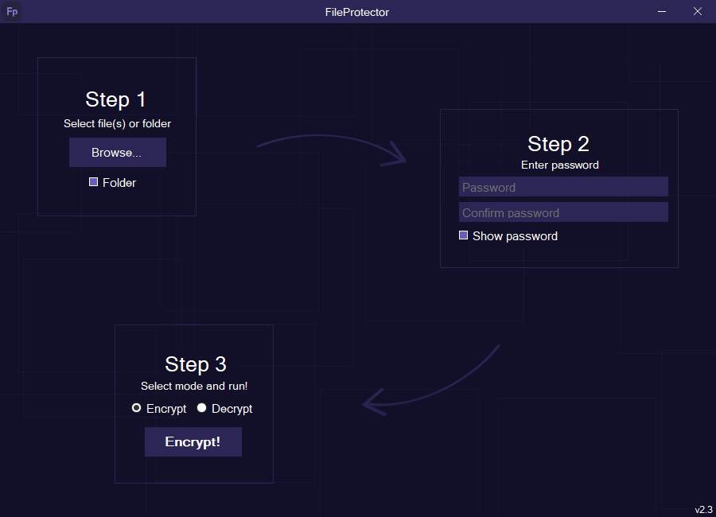

  

<h1 align="center" style="margin: 0; padding: 0;">FileProtector</h1>
<h3 align="center" style="margin: 0; padding: 0;">FileProtector is an files encryption application using AES-256 encryption algorithm</h3>

    

